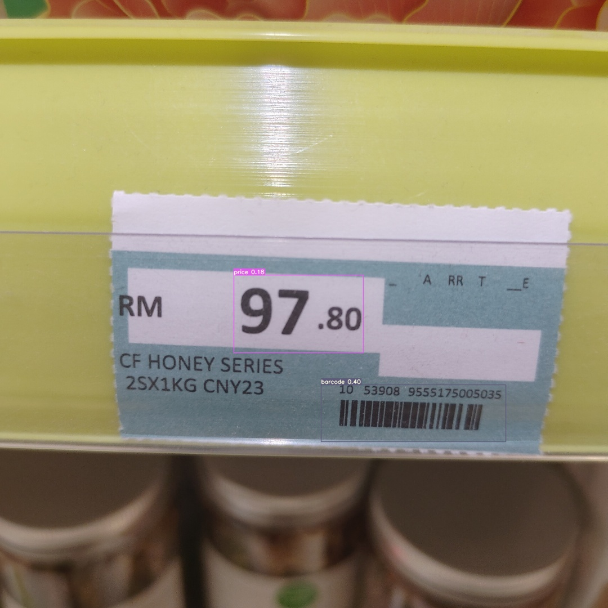

# Price Tag Data Extraction

Extracting the price and barcode from an image of price tag. 

# Description

Transfer learning is used to train a dataset of 42 price tag on YOLOv7. 
The dataset is annotated to only include the price and barcode instances. After getting the bounding boxes of barcode and price tag, the image is cropped. A pretrained OCR model is used perform text detection and recognition on the cropped region to get the text value for the price and barcode. Further post-processing like pattern matching is used to filter the results and get the final value. 



# Getting Started

* [Dataset](dataset) : Contains the images and annotations
* [Detection & OCR](Instance%20Detection%20%2B%20OCR.ipynb) : Code and visualization of results

# Installation

## YOLOv7 on custom dataset

To train the yolov7 model, change directory to yolov7/ and run :
```
python train.py --workers 1 --device 0 --batch-size 16 --epochs 10 --img 640 640 --hyp data/hyp.scratch.custom.yaml --name yolov7-custom --weights yolov7.pt

```

To run inference, change configuration in yolov7/detect_custom.py and execute the script:

```
python detect_custom.py
```
Training and inference results will be stored in the yolov7/runs folder. 

# Future Work & Improvements

Training a text detection model on own dataset instead of using a pretrained model for inference would be a better way to improve on the results. NLP tasks like Named Entity Recogntion can also me used to classify the text instead of using pattern/string matching. 

# Acknowledgement

* [PaddleOCR](https://github.com/PaddlePaddle/PaddleOCR)
* [YOLOv7](https://github.com/WongKinYiu/yolov7)


